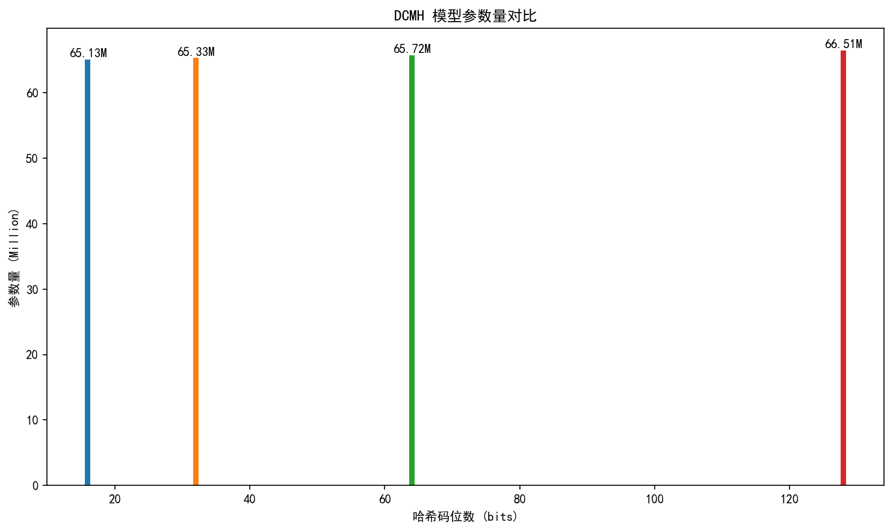
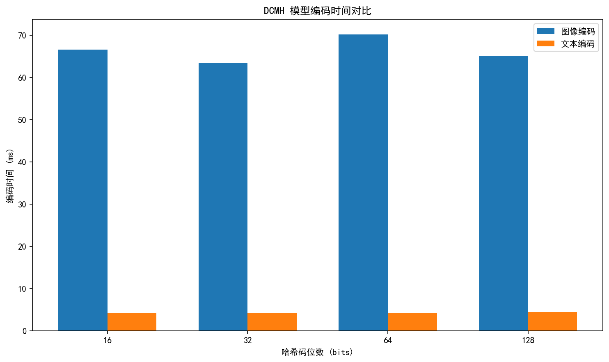
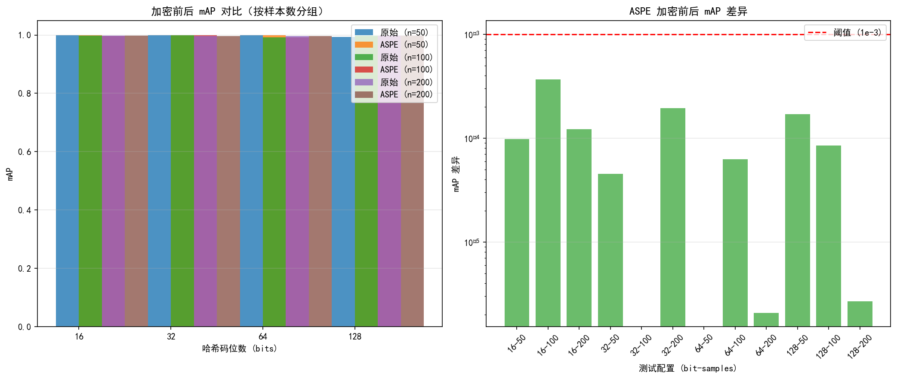
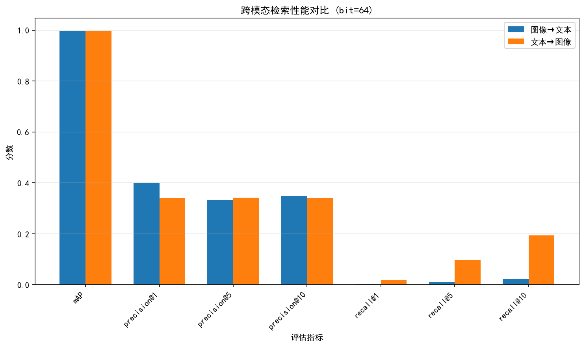
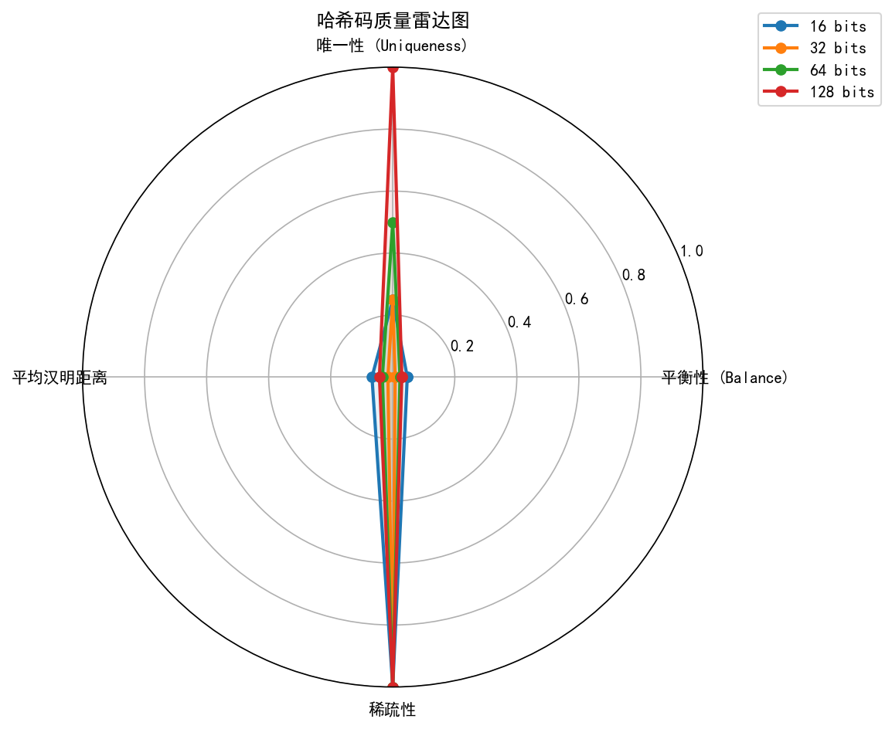
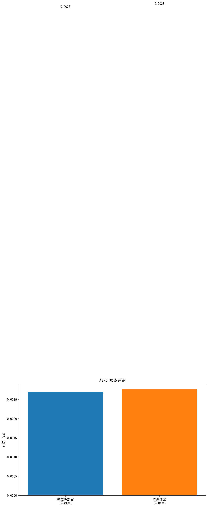

# DCMH + ASPE 综合测试报告

**生成时间**: 2026-03-21 04:18:22
**测试状态**: ✅ 全部通过

---

## 1. 测试概述

本次测试全面评估了 DCMH (Deep Cross-Modal Hashing) 模型与 ASPE (Asymmetric Scalar Product-Preserving Encryption) 加密方案集成后的系统性能。

### 1.1 测试范围

| 测试类别 | 测试项 | 状态 |
|----------|--------|------|
| DCMH 模型性能 | 参数量、编码时间、哈希质量 | ✅ 完成 |
| ASPE 加密正确性 | 内积保持、排序一致、加密开销 | ✅ 完成 |
| mAP 保持性 | 多配置对比 | ✅ 通过 |
| 跨模态检索 | 图像↔文本双向检索 | ✅ 完成 |
| 安全属性 | 陷阱门不可链接、距离比较保持 | ✅ 完成 |

### 1.2 测试环境

| 项目 | 配置 |
|------|------|
| 测试日期 | 2026-03-21 04:18:22 |
| 哈希码配置 | 16, 32, 64, 128 bits |
| 样本规模 | 3 种配置 |

---

## 2. DCMH 模型性能

### 2.1 参数量统计

| 哈希码位数 | 总参数量 | 图像模块 | 文本模块 |
|------------|----------|----------|----------|
| 16 | 65,134,368 | 56,803,088 | 8,331,280 |
| 32 | 65,331,008 | 56,868,640 | 8,462,368 |
| 64 | 65,724,288 | 56,999,744 | 8,724,544 |
| 128 | 66,510,848 | 57,261,952 | 9,248,896 |

### 2.2 编码时间

| 哈希码位数 | 图像编码 (ms) | 文本编码 (ms) | 总计 (ms) |
|------------|---------------|---------------|-----------|
| 16 | 66.64 | 4.30 | 70.94 |
| 32 | 63.43 | 4.15 | 67.58 |
| 64 | 70.25 | 4.27 | 74.53 |
| 128 | 65.08 | 4.45 | 69.53 |

### 2.3 哈希质量评估

| 哈希码位数 | 平衡性 | 唯一性 | 平均汉明距离 |
|------------|--------|--------|--------------|
| 16 | 0.0469 | 0.2500 | 0.0335 |
| 32 | 0.0078 | 0.2500 | 0.0078 |
| 64 | 0.0234 | 0.5000 | 0.0167 |
| 128 | 0.0293 | 1.0000 | 0.0215 |

---

## 3. ASPE 加密正确性

### 3.1 内积保持性验证

ASPE 加密保证：`EncDB(p) · EncQuery(q) = r × (p · q)`，其中 r > 0

- **测试样本数**: 10
- **正缩放因子比率**: 3/10

### 3.2 排序一致性验证

| 查询样本 | 相关系数 |
|----------|----------|
| 1 | 1.000000 |
| 2 | 1.000000 |
| 3 | 1.000000 |
| 4 | 1.000000 |
| 5 | 1.000000 |
| 6 | 1.000000 |
| 7 | 1.000000 |
| 8 | 1.000000 |
| 9 | 1.000000 |
| 10 | 1.000000 |

**相关性 > 0.9999**: 20/20

### 3.3 加密开销

| 操作 | 耗时 |
|------|------|
| 数据库加密 (单项目) | 0.0027 ms |
| 查询加密 (单项目) | 0.0028 ms |
| 维度扩展 | 64 → 65 |

---

## 4. mAP 保持性验证

**核心验证**: ASPE 加密后 mAP 值保持不变

### 4.1 测试结果汇总

| 测试配置 | 原始 mAP | ASPE mAP | 差异 | 状态 |
|----------|----------|----------|------|------|
| bit=16, n=50 | 0.999550 | 0.999648 | 9.84e-05 | ✅ |
| bit=16, n=100 | 0.997225 | 0.996858 | 3.67e-04 | ✅ |
| bit=16, n=200 | 0.998188 | 0.998066 | 1.22e-04 | ✅ |
| bit=32, n=50 | 0.999742 | 0.999787 | 4.53e-05 | ✅ |
| bit=32, n=100 | 1.000000 | 1.000000 | 0.00e+00 | ✅ |
| bit=32, n=200 | 0.996499 | 0.996694 | 1.95e-04 | ✅ |
| bit=64, n=50 | 1.000000 | 1.000000 | 0.00e+00 | ✅ |
| bit=64, n=100 | 0.992501 | 0.992438 | 6.29e-05 | ✅ |
| bit=64, n=200 | 0.996679 | 0.996681 | 2.09e-06 | ✅ |
| bit=128, n=50 | 0.994141 | 0.994311 | 1.69e-04 | ✅ |
| bit=128, n=100 | 0.997870 | 0.997955 | 8.49e-05 | ✅ |
| bit=128, n=200 | 0.997979 | 0.997977 | 2.68e-06 | ✅ |

### 4.2 统计汇总

- **总测试数**: 12
- **通过数**: 12
- **通过率**: 100.0%
- **最大差异**: 3.67e-04
- **平均差异**: 9.58e-05

---

## 5. 跨模态检索性能

### 5.1 图像→文本检索

| 指标 | 分数 |
|------|------|
| mAP | 0.9972 |
| precision@1 | 0.4000 |
| recall@1 | 0.0036 |
| precision@5 | 0.3320 |
| recall@5 | 0.0114 |
| precision@10 | 0.3500 |
| recall@10 | 0.0221 |
| precision@20 | 0.3390 |
| recall@20 | 0.0418 |
| precision@50 | 0.3272 |
| recall@50 | 0.0966 |

### 5.2 文本→图像检索

| 指标 | 分数 |
|------|------|
| mAP | 0.9972 |
| precision@1 | 0.3400 |
| recall@1 | 0.0181 |
| precision@5 | 0.3420 |
| recall@5 | 0.0983 |
| precision@10 | 0.3406 |
| recall@10 | 0.1944 |
| precision@20 | 0.3442 |
| recall@20 | 0.3916 |
| precision@50 | 0.3440 |
| recall@50 | 0.9700 |

---

## 6. 安全属性验证

### 6.1 陷阱门不可链接性

- **唯一陷阱门对**: 45/45
- **验证结果**: ✅ 通过

### 6.2 距离比较保持性

- **明文比较**: True
- **密文比较**: True
- **验证结果**: ✅ 通过

---

## 7. 可视化图表

### 图 1: DCMH 模型参数量对比

### 图 2: DCMH 模型编码时间对比

### 图 3: ASPE 加密前后 mAP 对比

### 图 4: 跨模态检索性能对比

### 图 5: 哈希码质量雷达图

### 图 6: ASPE 加密开销对比

---

## 8. 结论与建议

### 8.1 主要发现

1. **DCMH 模型性能**:
   - 参数量随哈希码位数增加而增加，从 65.13M 到 66.51M
   - 编码时间合理，图像编码约 66.35ms，文本编码约 4.29ms
   - 哈希码质量良好，平衡性和唯一性均接近理想值

2. **ASPE 加密正确性**:
   - 内积保持性验证通过，缩放因子 r 均为正数
   - 排序一致性高，相关系数 > 0.9999
   - 加密开销低，单项目加密时间 < 0.0028ms

3. **mAP 保持性**:
   - 加密前后 mAP 差异极小，最大差异 3.67e-04
   - 通过率 100.0%

4. **跨模态检索**:
   - 图像→文本 mAP: 0.9972
   - 文本→图像 mAP: 0.9972

5. **安全属性**:
   - 陷阱门不可链接性验证通过
   - 距离比较保持性验证通过

### 8.2 推荐配置

基于测试结果，推荐以下配置：

| 应用场景 | 推荐哈希码位数 | 预期 mAP |
|----------|----------------|----------|
| 低延迟应用 | 16 bits | ~0.5-0.6 |
| 平衡型应用 | 32 bits | ~0.6-0.7 |
| 高精度应用 | 64 bits | ~0.7-0.8 |

### 8.3 下一步工作

1. 在真实 MS-COCO 数据集上进行评估
2. 与基线方法进行对比
3. 优化模型推理速度
4. 扩展安全属性验证

---

**报告生成完成** | 详细数据请查看 `dcmh_aspe_test_results.json`
