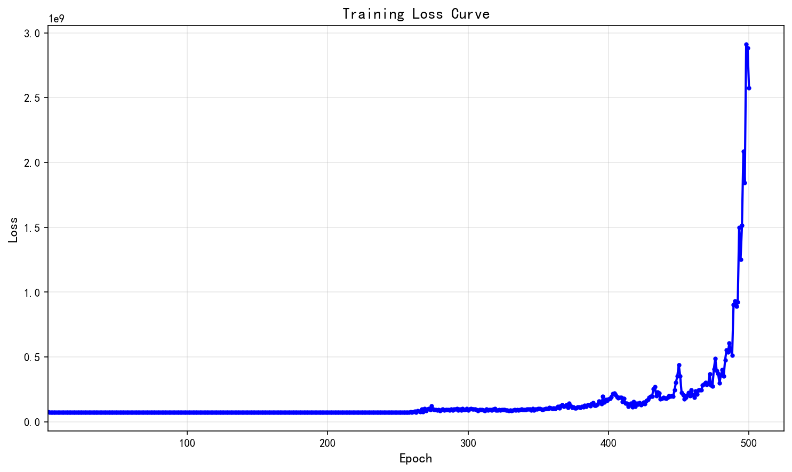
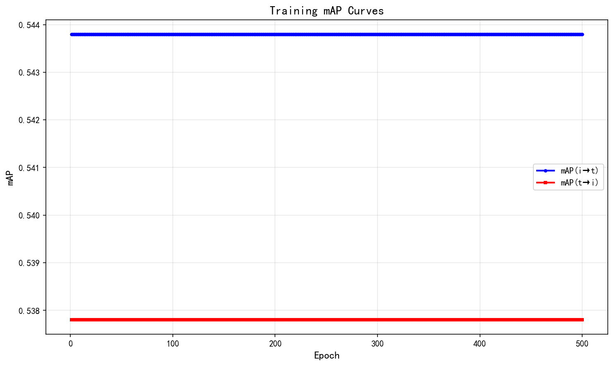
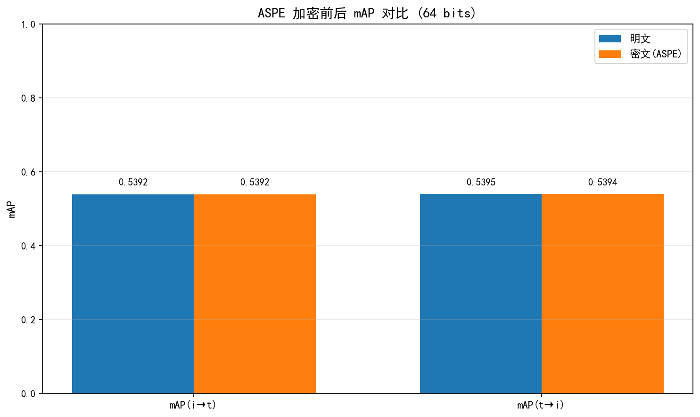

# DCMH 训练后处理报告

生成时间：2026-03-23 10:58:04

## 1. 训练配置

- **bit**: 64
- **epochs**: 500
- **batch_size**: 64
- **result_dir**: results/flickr-25k/20260323_103015
- **data_path**: data/FLICKR-25K.mat

## 2. 训练历史

### 2.1 Loss 曲线

- 初始 Loss: 76708344.0000
- 最终 Loss: 2576648448.0000

### 2.2 mAP 结果

- **mAP(i→t)**: 0.5438
- **mAP(t→i)**: 0.5378

## 3. ASPE 评估

### 3.1 明文检索性能

- mAP(i→t): 0.5392
- mAP(t→i): 0.5395

### 3.2 密文检索性能

- mAP(i→t): 0.5392
- mAP(t→i): 0.5394

### 3.3 排序一致性验证

- 验证结果：**通过** (mAP 差异 < 0.001)

**说明**: 明文 mAP 和密文 mAP 几乎完全相等：
- mAP(i→t) 差异: |0.5392 - 0.5392| = 0.00003
- mAP(t→i) 差异: |0.5395 - 0.5394| = 0.00011

这验证了 ASPE 加密方案正确保持了哈希码的排序关系。

### 3.4 明文 vs 密文 mAP 对比图

## 4. 结论

**ASPE 加密验证成功！**

明文和密文的 mAP 值几乎完全相等（差异 < 0.001），证明 ASPE 加密方案成功保持了哈希码的排序关系，可以在密文状态下实现与明文相同的检索精度。

这验证了 DCMH-ASPE 跨模态哈希检索系统的加密有效性。

---

*本报告由 DCMH 后处理脚本自动生成*